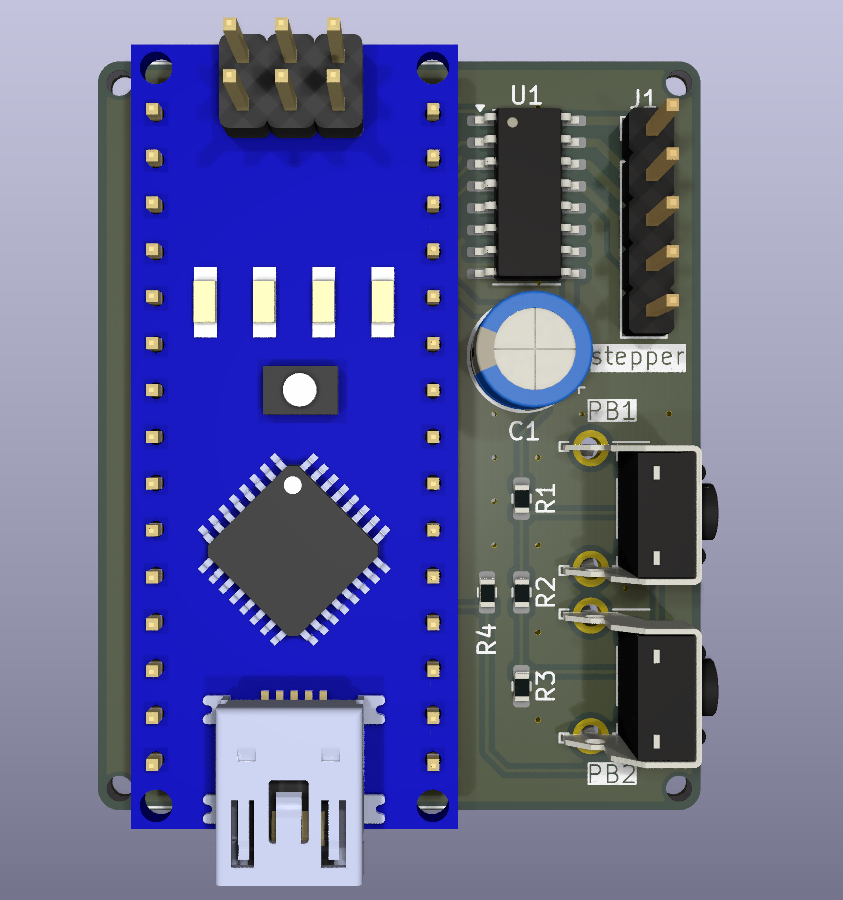
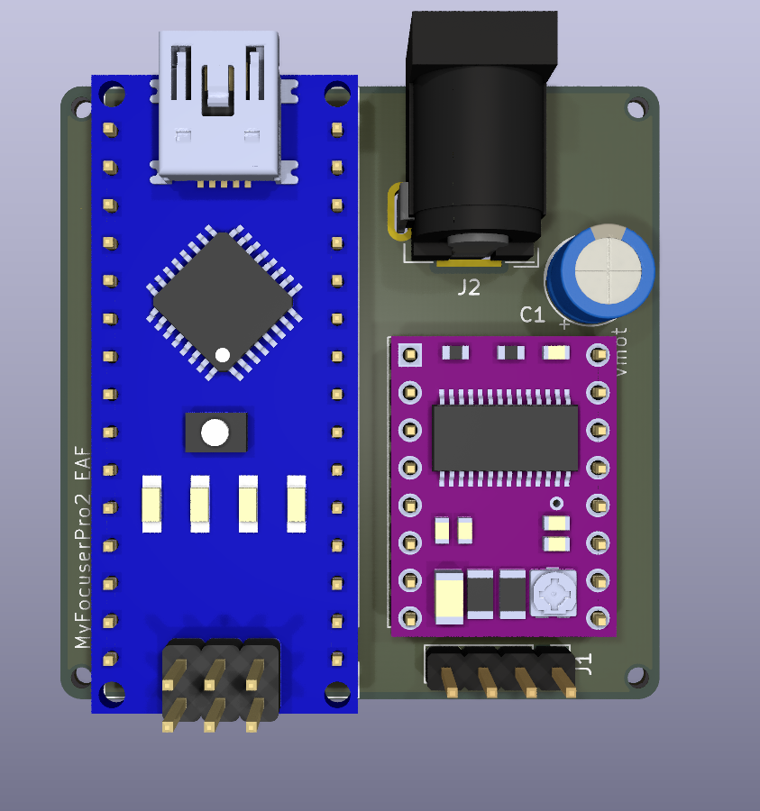

# myfocuserpro2-pcbs

Custom PCBs for the MyFocuserPro2 project.

There are custom PCBs using an Arduino Nano and a driver with the corresponding [MyFocuerPro2 firmare](https://sourceforge.net/projects/arduinoascomfocuserpro2diy/).

DISCLAIMER: I designed and ordered the PCBs just last night, so I haven’t had the opportunity to test them yet. I’ll confirm their functionality as soon as they arrive. Your reviews and pull requests are welcome. As with any DIY project, please proceed at your own risk.

## ULN2003

This version used with the 28BYJ-48 5V stepper powered directly from USB and a simple ULN2003 driver.
Intended to be used with an OAG or Guidescope, with 2 push bottons to retain the ability to adjust the scope manually.

## DRV8825

This version is used with a geared Nema17 and external 12V power, intended to handle heavier image trains.
It has the footprint to expand it with a set of push bottons if desired.

